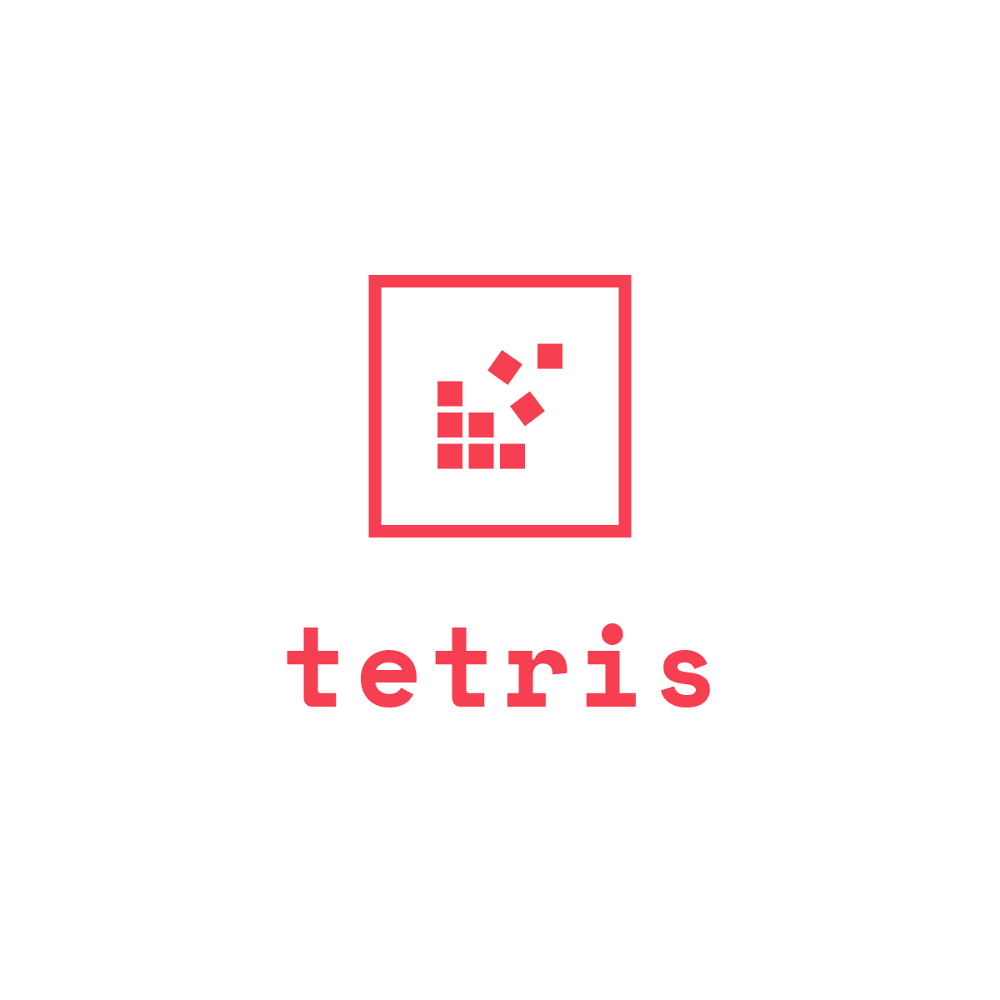

<h2 align="center">
    
</h2>

キーボード入力でテトリスを遊ぶことができる[Webアプリ](https://tetris-greenteam.vercel.app/)です。

一行消すごとに＋10pt加算されていきます。

## 操作方法
→ : 右移動

← : 左移動

↓ : 下移動

↑ : 回転

## URL
https://tetris-greenteam.vercel.app